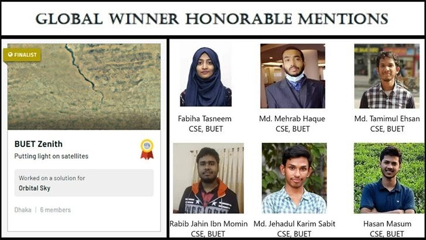

# Starduino

This is the arduino part of the project [Satellight: Putting lights on satellite](https://satellight.netlify.app/)

### Android

Here a arduino bluetooth connection is used to transfer data from android to arduino. The android takes the user location information and the expected 3D location then after calculating the angle and alevation will send those information to the arduino.

### Arduino

 In hardware I have used two stepper motors and bluetooth module and arduino uno.

### Showcase

Image of project:

### Achievements

The project Satellight has become the Regional Champion from Bangladesh in NASA Space Apps 2020

Result Announcement: [Global Winner Honorable Mention List](https://2020.spaceappschallenge.org/awards/honorable-mentions)

Competition Website: https://www.spaceappschallenge.org/

Facebook Page: https://www.facebook.com/SpaceAppsChallengeBangladesh

Featured in BUET Website: https://www.buet.ac.bd/web/#/details/5

**Newspaper Links**

- [দৈনিক প্রথম আলো](https://www.prothomalo.com/feature/shapno/বুয়েট-পেল-নাসার-পুরস্কার)
- [দৈনিক জনকণ্ঠ](https://www.dailyjanakantha.com/details/article/552918/অনারেবল-মেনশন-তালিকায়-বাংলাদেশ/)
- [Somoy News TV](https://m.somoynews.tv/pages/details/261544?fbclid=IwAR1tx4B7Nqky5IB6aMUmgRE3SoGPRhbfvx1hMJPElsBYEnf6swB61E05ydg)
- [দৈনিক যুগান্তর](https://www.jugantor.com/tech/389111/নাসা-স্পেস-অ্যাপস-প্রতিযোগিতায়-ওয়ার্ল্ড-চ্যাম্পিয়ন-বাংলাদেশ?fbclid=IwAR2ESizi_2BY1lpq4l2Mu4rm2srVrWM844WpcbkAMbeapVq3TMXj3Gqz0xo)
- [BD News 24](https://bangla.bdnews24.com/tech/article1854041.bdnews)
- [Dhaka Tribune](https://www.dhakatribune.com/bangladesh/2021/01/30/bangladesh-wins-in-honourable-mention-category-of-nasa-space-app-challenge?fbclid=IwAR1tx4B7Nqky5IB6aMUmgRE3SoGPRhbfvx1hMJPElsBYEnf6swB61E05ydg)
- [Business Insider BD](https://www.businessinsiderbd.com/tech/news/2136/buet-team-becomes-category-champion-in-nasa-apps-contest?fbclid=IwAR1hLbrAS_hXmQrXuOLYVGBsk-MZOl2c-TxEHfcs7lfxUhMezRyynJimADs)
- [দৈনিক ভোরের পাতা](https://dailyvorerpata.com/details.php?id=55670)
- [দৈনিক আলোকিত সময়](https://dainikalokitosomoy.com/2021/01/30/নাসা-অনারেবল-মেনশন-ক্য/#.YBj3LugzZPY)
- [Tech Shohor](https://techshohor.com/182638/স্পেস-অ্যাপস-প্রতিযেগিতা/)
- [Daily Bangladesh](https://www.daily-bangladesh.com/education/229694)
- [Bonik Barta](https://bonikbarta.net/home/news_description/254585/গ্লোবাল-ফাইনালিস্ট-‘অনারেবল-মেনশন’-তালিকায়-বাংলাদেশ)
- [Notun Shomoy](https://notunshomoy.com/details.php?id=103144&fbclid=IwAR1i7cbR4nGWGI9kPlfKydVpuo3882ApDrThm6xvhoM3pAt409h253VShQQ)
- [NNB News](https://www.nnb.com.bd/details.php?id=42630)
- [Sara Bangla Newspaper](https://sarabangla.net/post/sb-513424/)
- [Saradin News](http://saradin.news/archives/57082)
- [Probash Journal](http://probashjournal.com/2021/01/30/নাসার-স্পেস-অ্যাপস-প্রতি/)
